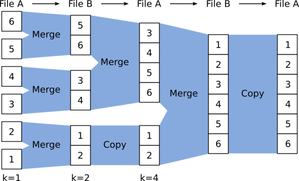

# large-file-sorting
Large text file alphabetical sorting algorithm implementation.

[](https://github.com/oleggr/large-file-sorting/actions/workflows/linting.yml)
---

### Usage

Simply run below command:
```bash
python3 sorter.py
```

Application uses standard libraries so you don't need to install any requirements.

On first run app will generate large text file `test.txt`. 
You can specify it's size by changing number of lines and line length. 

### Algorithm

App sort file with [external merge algorithm](https://en.wikipedia.org/wiki/External_sorting).
Big file sliced by small portions that can easily fit into RAM. Each chunk then sorting and after that
chunks merged into chunk composition. Last chunk composition is sorted source file.

   

### Contacts

- Telegram - [@grit4in](https://t.me/grit4in)

[Up](#large-file-sorting)